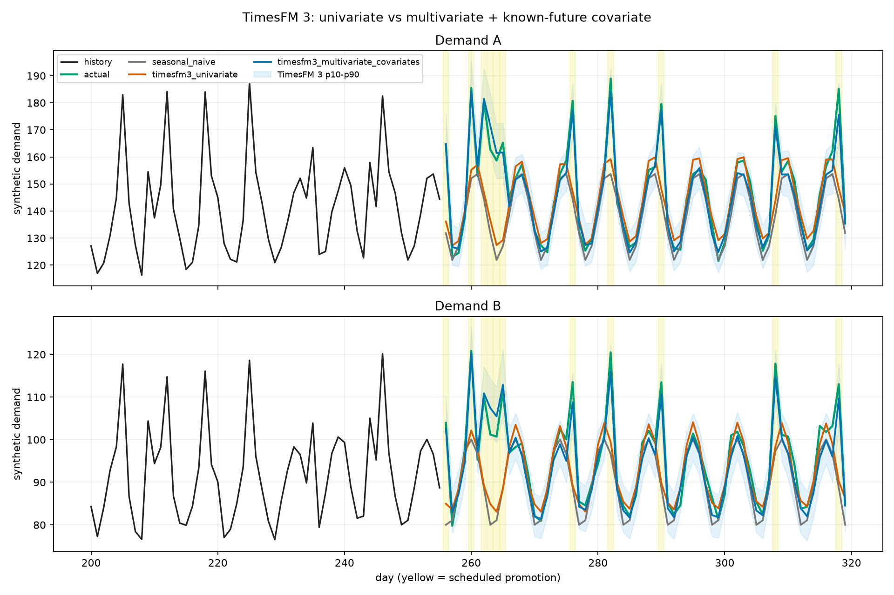
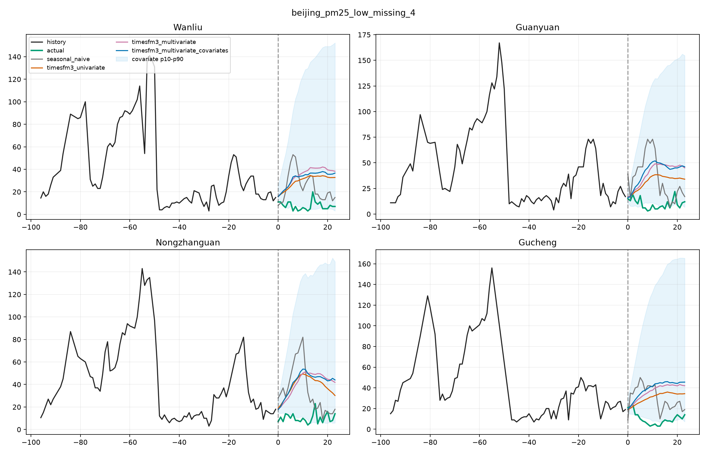
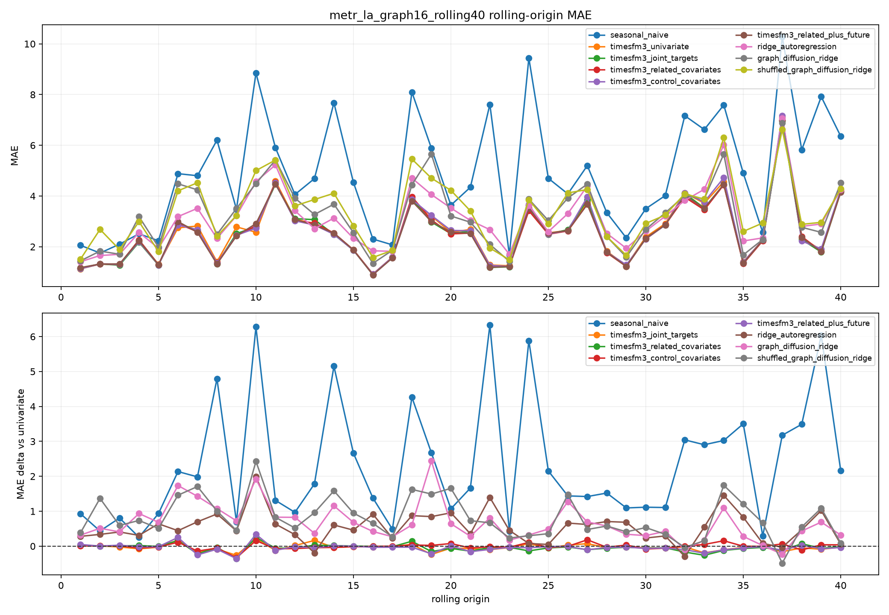
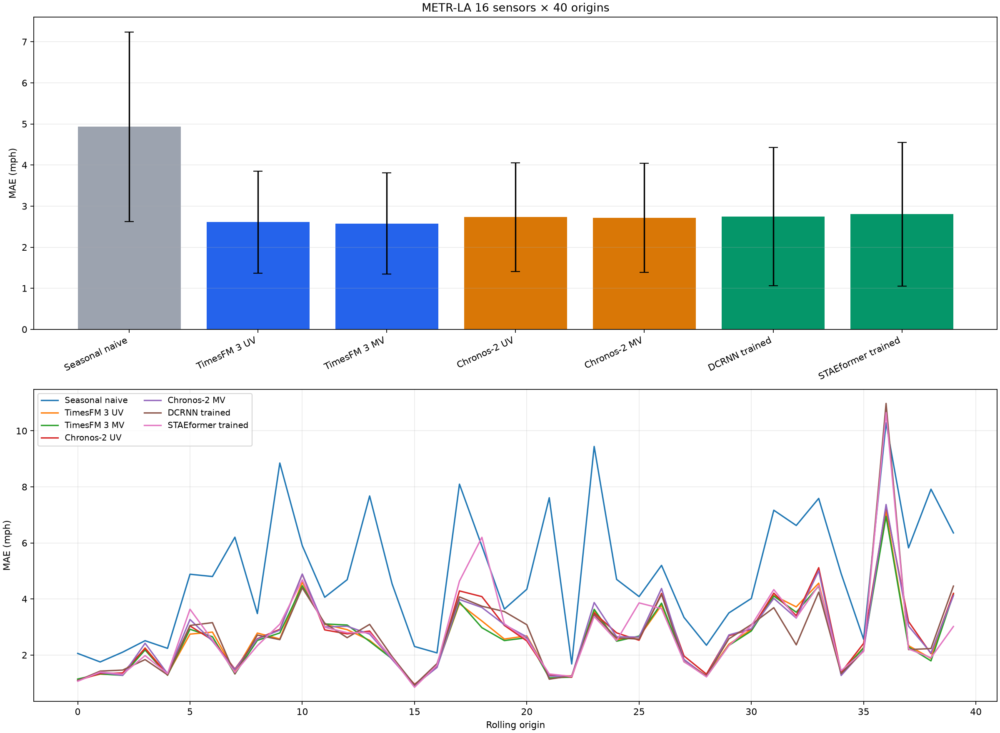

# TimesFM 3 다변량 예측 기능의 실증 평가

## 합성 검증에서 METR-LA 16센서·40-origin 모델 비교까지

> **사용 경계.** TimesFM 소스 코드는 Apache-2.0이지만, TimesFM 3 사전학습 가중치는 `timesfm-non-commercial-license-v1.0`에 따라 **비상업·비프로덕션 용도로만** 사용할 수 있다.[^timesfm3-repo][^timesfm3-model] 본 연구의 모든 실험은 로컬 평가 목적이며, 어떤 결과도 상업·운영 배포의 근거로 사용하지 않는다.

# 초록

Google이 2026년 8월 말 공개한 TimesFM 3는 여러 타깃과 과거 전용·미래까지 아는 공변량을 한 번의 추론으로 처리하는 다변량 zero-shot 예측을 새 기능으로 내세운다.[^timesfm3-release] 본 연구는 그 기능이 실제 공개 데이터에서 **반복 가능한 이득**을 내는지, 어떤 조건에서 그런지, 직접 경쟁 zero-shot 모델과 교통 전용 supervised 모델에 비해 어디쯤인지를 하루 동안 진행한 일곱 단계의 로컬 실험으로 검증한다. 정답 효과를 알고 설계한 합성 데이터의 인터페이스 확인에서는, 미래 프로모션 공변량을 받은 모델이 프로모션 반응을 설계값 32.8/21.0에 가까운 32.55/21.74로 재현했다(MAE 단변량 6.4724 → 2.4358, 단 이 차이는 설계에서 비롯한 것이며 성능 증거가 아니다). 실제 데이터의 첫 단일 holdout에서는 M5 판매량이 계절 naive 대비 22.1% 개선됐지만 Beijing PM2.5의 급격한 저농도 전환에서는 다변량·공변량 입력이 오히려 악화됐다. 이 결과를 근거로 평가를 재설계해, M5를 같은 SKU×3개 매장 rolling-origin으로, METR-LA를 인접 센서 대 원거리 대조군 rolling-origin으로 재구성했다. 누수 없는 센서 선택과 40개 비중첩 origin으로 확장한 METR-LA에서 공동 다변량 예측은 단변량보다 MAE가 1.38% 낮았고(30/40 승), 7-origin moving-block bootstrap 95% 구간 `[-0.05924, -0.01140]`이 0을 배제했다. 인접 센서 입력은 1.73% 개선(29/40 승, 구간 `[-0.07666, -0.01388]`)인 반면 원거리 대조군은 0.17% 개선에 그쳐 구간이 0을 포함했다. 같은 16센서·40 origin에서 TimesFM 3 다변량 MAE 2.57554는 Chronos-2 다변량 2.71788보다 5.24% 낮았고(28/40 승, 구간 `[-0.19343, -0.09510]`), 로컬 학습한 DCRNN 2.74131과는 구간 `[-0.00637, 0.37115]`이 0을 포함해 우열을 확정하지 못했으며, STAEformer 2.80180보다는 낮았다. FEV-Bench 다변량 3개 task는 Google 공개 SQL과 평균 절대 2.38% 차이로 근접 재현됐다. 1차 결론은 다음으로 고정한다. **TimesFM 3의 다변량 모드는 유효하며 cross-series 신호가 있을 때 작지만 반복되는 이득을 낸다. 같은 16센서 METR-LA zero-shot 패널에서 Chronos-2보다 우수했다. 그러나 이것이 DCRNN·STAEformer에 대한 일반적 우위나, 다변량 입력이 항상 도움이 된다는 뜻은 아니다.**

# 키워드

TimesFM 3, 다변량 시계열 예측, zero-shot foundation model, known-future covariate, negative control, rolling-origin 평가, moving-block bootstrap, METR-LA, M5, Beijing PM2.5, FEV-Bench, Chronos-2, DCRNN, STAEformer, 재현성

# 1. 서론과 동기

## 1.1 배경

시계열 foundation model은 지금까지 주로 단변량 zero-shot 예측에서 평가돼 왔다. TimesFM 3는 Google 발표 기준으로 3억 3천만 파라미터, 1조 개 이상의 시간점으로 사전학습됐고, 여러 타깃과 과거 전용·과거/미래 공변량을 함께 받아 causal temporal attention과 full variate attention을 교대로 적용하며, p10부터 p90까지 9개 분위수를 예측한다. Google은 GIFT-Eval, FEV-Bench, TIME에서 평가했다고 밝혔다.[^timesfm3-release] 이 수치와 구조 설명은 **제작사 주장**이며, 본 연구가 독립적으로 확인한 사실이 아니다.

## 1.2 왜 로컬에서 다시 검증하는가

제작사 벤치는 평균 순위로 보고되므로 "다변량 입력이 어떤 데이터에서, 어떤 관계가 있을 때, 얼마나 반복적으로" 도움이 되는지는 알려주지 않는다. 실무에서 중요한 질문은 다음 셋이다.

1. 관련 시계열을 함께 넣으면 단변량보다 실제로 좋아지는가, 아니면 입력이 늘어난 효과일 뿐인가.
2. 관계가 없는 시계열을 섞으면 중립인가, 아니면 negative transfer가 생기는가.
3. 다변량 zero-shot 경쟁 모델(Chronos-2)과 데이터셋 전용 supervised 모델(DCRNN, STAEformer)에 비해 어디쯤인가.

## 1.3 연구 범위와 증거 기준

본 연구는 합성 검증, 실제 데이터 단일 holdout, rolling-origin 재설계, 누수 통제 강화, 외부 벤치마크 근접 재현, 경쟁 모델 비교의 일곱 단계로 구성된다. 모든 수치의 권위는 프로젝트 디렉터리에 저장된 결과 JSON이며, 파생 백분율은 보고서 작성 시 해당 JSON에서 다시 계산했다. 탐색 결과와 사전 고정된 확인 실험을 구분하고, 결과를 본 뒤 도출한 해석은 사후 해석으로 명시한다.

# 2. 연구 질문과 기여

## 2.1 연구 질문

- **RQ1.** TimesFM 3의 다변량 모드는 실제 데이터에서 단변량보다 반복 가능한 이득을 내는가.
- **RQ2.** 그 이득은 입력 시계열의 관계(인접·동일 SKU)에 의존하는가, 아니면 임의의 추가 입력에서도 나타나는가.
- **RQ3.** 같은 조건의 zero-shot 경쟁 모델과 데이터셋 전용 supervised 모델과 비교했을 때 TimesFM 3는 어디에 있는가.

## 2.2 기여

1. 합성·실제 데이터 6개 실험군을 **사전 고정 설계 → 실패 사례 → 재설계 → 엄격화**의 순서로 기록해, 효과 크기가 설계 강화에 따라 어떻게 보정되는지를 보여준다.
2. METR-LA에서 인접 센서 대 원거리 센서, 실제 그래프 대 셔플 그래프라는 **negative control**을 같은 origin에서 비교했다.
3. 센서 선택을 시계열 최초 50%로 제한하고 평가 context와 975 point 간격을 둔 **누수 없는 40-origin** 설계와 moving-block bootstrap paired interval을 제공한다.
4. 같은 16센서·40 origin에서 TimesFM 3, Chronos-2, DCRNN, STAEformer를 **두 트랙으로 분리**해 비교하고, 학습 비용·checkpoint·재검증 증거를 함께 남긴다.
5. FEV-Bench 다변량 3개 task를 공식 wrapper로 근접 재현하고, dataset fingerprint 불일치를 명시한다.

# 3. 관련 모델과 벤치마크 맥락

## 3.1 비교 모델

| 모델 | 성격 | 본 연구에서의 역할 | 출처 |
|---|---|---|---|
| TimesFM 3 (`google/timesfm-3.0-pytorch`) | zero-shot foundation model, 다변량·공변량 지원 | 평가 대상 | [^timesfm3-release][^timesfm3-model] |
| Chronos-2 (`amazon/chronos-2`, 패키지 2.3.1) | zero-shot foundation model, 단변량·다변량·공변량 지원 | 직접 zero-shot 비교군 | [^chronos2] |
| DCRNN | 도로 그래프 diffusion convolution + recurrent, 교통 전용 supervised | supervised 교통 모델 기준점 | [^dcrnn-paper][^dcrnn] |
| STAEformer | spatio-temporal adaptive embedding Transformer, 교통 전용 supervised | 비교적 현대적 supervised 기준점 | [^staeformer] |
| Torch-MTS DCRNN/STAEformer 구현 | STAEformer 저자가 유지하는 공통 PyTorch 프레임 | 두 supervised 모델의 실제 학습 코드 | [^torch-mts] |
| 계절 naive | 마지막 한 주기 반복 | 하한 진단 기준선 | — |
| ridge 자기회귀 / graph-diffusion ridge / shuffled-graph ridge | 선형 진단 모델 | 그래프에 신호가 있는지 보는 **진단용**, 경쟁 모델 아님 | [^dcrnn] |

## 3.2 기준선의 등급 구분

본 연구는 기준선을 세 등급으로 나눠 부른다. 등급을 섞으면 결론이 부풀려진다.

- **진단 기준선**: 계절 naive, ridge 계열. 데이터에 어떤 신호가 있는지 보여주지만 모델 경쟁력은 말하지 않는다.
- **zero-shot 경쟁 모델**: Chronos-2. 같은 context·타깃·origin으로 TimesFM 3와 직접 비교 가능하다.
- **supervised 전용 모델**: DCRNN, STAEformer. 데이터셋별 gradient 학습을 거치므로 zero-shot 모델과는 **다른 트랙**이다.

## 3.3 외부 벤치마크

FEV는 rolling window, covariate, 점·확률 예측 지표를 재현 가능하게 정의하는 AutoGluon의 평가 라이브러리이고, Google은 TimesFM 3 공개 시 FEV-Bench 100개 task 결과 CSV를 저장소에 포함했다.[^fev][^official-fev-results] 본 연구는 그중 경량 다변량 3개만 재현한다.

# 4. 데이터셋과 선택 이유

| 데이터 | 단위·주기 | 이 연구에서의 범위 | 왜 골랐는가 | 사용 경계 |
|---|---|---|---|---|
| 합성 일별 수요 | 가상 상품 2개의 일별 수요 A·B, 공유 방문객 요인, 이진 프로모션; seed 7 | context 256일 → horizon 64일, horizon 안 프로모션 11일 | 정답 lift(32.8/21.0)를 알고 설계해 known-future 공변량 인터페이스와 반응 크기를 확인 | 자체 생성(생성식은 7.1절), 성능 증거 아님 |
| M5 Walmart | 상품별 일별 판매량, 캘린더, 가격 | `CA_1/FOODS_3` 상위 16개 (512일→28일); 이후 같은 8 SKU×CA 3매장 24타깃 rolling 5 | 미래에 아는 가격·행사·SNAP 공변량, 다중 타깃 | Kaggle 대회 규칙; Zenodo 보존본으로 전송[^m5-data][^m5-mirror] |
| Beijing Multi-Site Air Quality | 12개 관측소 시간별 PM2.5·기상 | 결측 최저 4개 관측소, 336h→24h | 관측소 간 공동 변동과 기상 공변량 | CC BY 4.0[^beijing-uci] |
| METR-LA | 207개 고속도로 센서, 5분 속도 | 16개 타깃 센서, 7일 context → 1시간 horizon, rolling 10 → 40 | 공개 도로 그래프로 인접·원거리·셔플 대조군을 **사전에** 만들 수 있고, 정체의 상류→하류 전파가 실제 선행정보가 될 수 있으며, DCRNN·STAEformer의 표준 데이터 | DCRNN 저장소가 연결한 공개 파일[^dcrnn] |
| FEV-Bench 3 task | `ETT_1W`(7변수), `uci_air_quality_1D`(4타깃+기상), `gvar`(6타깃+과거 공변량) | 공식 task 정의 그대로 | 다른 도메인의 경량 다변량 task, Google 공개 수치와 비교 가능 | fev 0.9.0, tasks 커밋 고정[^fev] |

METR-LA를 주 실험으로 선택한 이유는 M5의 변수 관계가 간접적이고 Beijing에는 급격한 외생 전환이 있었기 때문이다. 공개 도로 그래프로 관련 센서와 원거리 대조군을 사전에 구성할 수 있어, "관계가 있는 시계열이 실제 선행정보인가"를 더 직접적으로 시험할 수 있다.

# 5. 실험 설계와 누수 통제

## 5.1 단계별 설계와 사전 고정 여부

| 단계 | 설계 | 사전 고정·통제 | 증거 유형 |
|---|---|---|---|
| S0 합성 검증 | 단변량 vs 다변량+미래 공변량, 프로모션 반사실 | 결정적 seed | 단일 holdout |
| S1 첫 실제 holdout | M5 16상품, Beijing 4관측소 | 실행 전 대상·holdout 고정 | 단일 holdout |
| S2 재설계 | 판정 기준·후속 데이터 우선순위 설정 | 후속 실행 전 결정 | 설계 단계 |
| S3 rolling 후속 | M5 24타깃 rolling 5, METR-LA 16센서 rolling 10, FEV 3 task | 실행 전 고정 | rolling-origin |
| S4 엄격화 | 최초 50% 선택, 40 비중첩 origin, block bootstrap, 그래프 진단 | 실행 전 누수 점검 | rolling-origin + paired interval |
| S5 모델 비교 | 같은 패널에서 Chronos-2, DCRNN, STAEformer 비교 | 프로토콜 사전 고정 | 두 트랙 paired interval |
| S6 결론 | 16센서 범위 확정, 2단계 분리 | 주장 범위 제한 | 종합 해석 |

Beijing의 레짐 전환 해석, M5 대조군 해석, "16센서 선택이 탐색 설계로서 강점"이라는 프레임은 **사후 해석**이다. 각 절에서 이 구분을 유지한다.

## 5.2 공통 비교 조건

각 데이터에서 같은 origin에 대해 다음을 비교했다.

1. 계절 naive
2. TimesFM 3 단변량 (타깃마다 독립 추론)
3. TimesFM 3 공동 다변량 (모든 타깃을 한 번에)
4. TimesFM 3 관련 시계열을 과거 전용 공변량으로 추가
5. TimesFM 3 무관·원거리 시계열을 같은 크기의 대조군으로 추가
6. TimesFM 3 관련 시계열 + known-future 캘린더(·가격·행사) 공변량

## 5.3 누수 통제

- **M5**: 상품·SKU 선택은 context 판매량만 사용했고 holdout 28일은 보지 않았다.
- **Beijing**: context 결측만 선형 보간했고 holdout 정답은 보간하지 않았다. 미래에 관측된 실제 기상값은 공변량으로 넣지 않았다(누수).
- **METR-LA 10-origin**: 센서 선택에 결측 표지가 낮은 prefix(27,417 point, 전체의 80%)를 썼다. 평가 context보다 앞이지만 여유가 작았다.
- **METR-LA 40-origin**: 실행 전 점검에서 최초 계산식의 선택 구간이 가장 이른 context와 겹칠 수 있음을 발견해, 선택을 전체 34,272 point의 **최초 50%인 17,136 point**로 제한했다. 가장 이른 평가 context 시작은 18,111 point로 **975 point** 떨어져 있다. 40개 horizon(2012-05-09 21:15 ~ 2012-06-25 11:20)은 서로 겹치지 않으며 최소 간격은 288 point(하루)다.[^expanded-detail]
- **supervised 모델**: 센서 선택과 학습·validation 모두 최초 50% 안에서 수행했다(train 종료 13,708, validation 종료 17,136). checkpoint는 validation MAE로만 골랐고 평가 40개 origin은 모델 선택에 쓰지 않았다.[^comparison-result]
- **FEV**: task 정의·horizon·window·SQL 계산을 공식 wrapper 그대로 유지했다.

## 5.4 METR-LA 대조군 구성

- 타깃 16개: anchor 센서 `767509`에서 공식 도로망 거리로 확장한 클러스터. 40-origin 패널은 10-origin 패널과 9개만 겹친다.
- 인접 센서: 타깃별 공식 도로망 거리 최근접 4개, 평균 도로 거리 1,659 m.
- 원거리 대조군: 타깃별 지리적으로 가장 먼 4개, 평균 26.75 km.
- 셔플 그래프: 노드 라벨을 고정 seed 20260902로 섞은 adjacency.[^expanded-detail]

# 6. 지표와 해석

모든 point 지표는 프로젝트 코드의 `point_metrics`에서 계산했고 낮을수록 좋다. 타깃 $i$, horizon $h$, 실제값 $y_{i,h}$, 예측 $\hat y_{i,h}$, 타깃 수 $N$, horizon 길이 $H$라 하자.

- **MAE** (주지표): $\mathrm{MAE}=\frac{1}{NH}\sum_{i,h}\lvert \hat y_{i,h}-y_{i,h}\rvert$. METR-LA에서는 단위가 mph, M5는 판매 개수, Beijing은 µg/m³다.
- **RMSE**: $\sqrt{\frac{1}{NH}\sum_{i,h}(\hat y_{i,h}-y_{i,h})^2}$. 큰 오차에 민감하므로 보조 지표로만 쓴다.
- **WAPE**: $\frac{\sum_{i,h}\lvert \hat y_{i,h}-y_{i,h}\rvert}{\sum_{i,h}\lvert y_{i,h}\rvert}$. Beijing처럼 정답 수준이 낮으면 200%를 넘을 수 있다.
- **RMSSE** (타깃별 평균): $\sqrt{\frac{\frac{1}{H}\sum_h (\hat y_{i,h}-y_{i,h})^2}{\frac{1}{T-1}\sum_t (y_{i,t}-y_{i,t-1})^2}}$. 분모는 context의 **1차 차분** 제곱 평균, 즉 context 안에서 한 스텝 naive 예측이 냈을 오차의 스케일이다. 1보다 작으면 holdout 오차가 그 context 기준 스케일보다 작다는 뜻이지, holdout에서 "마지막 값 유지" 예측을 직접 이겼다는 뜻은 아니다. M5 대회의 가중 WRMSSE가 아니라 비가중 소규모 비교용이다.
- **p10–p90 coverage**: 실제값이 예측 분위수 p10 이상 p90 이하에 든 비율. 명목 80%에 가까울수록 보정이 좋다. **구간 폭**도 함께 본다.
- **rolling 집계**: origin별 MAE의 평균과 표준편차(ddof=1), **paired delta** $\Delta_o=\mathrm{MAE}_o^{\text{mode}}-\mathrm{MAE}_o^{\text{ref}}$의 평균, 승률 $\frac{1}{O}\sum_o \mathbf 1[\Delta_o<0]$.
- **상대 개선율**: $\frac{\mathrm{MAE}^{\text{mode}}-\mathrm{MAE}^{\text{ref}}}{\mathrm{MAE}^{\text{ref}}}\times 100$. 음수가 개선이다.
- **moving-block bootstrap 95% 구간** (40-origin 이후): origin 순서를 유지한 채 block 크기 7의 circular moving block을 복원 추출해 40개를 채우고, 10,000회 재표본 평균의 2.5·97.5 분위수를 구간으로 쓴다(seed 20260902). 인접 origin의 자기상관을 부분적으로 흡수하기 위한 선택이며, 정식 검정이 아니라 **효과 방향의 안정성** 지표로 읽는다.
- **SQL / MASE / WQL** (FEV): 공식 fev 정의를 그대로 사용했고, 비교 대상은 Google CSV의 같은 task 값이다.[^fev]

# 7. 결과

## 7.1 S0 합성 known-future 공변량 검증 (인터페이스 확인)

### 왜 합성 데이터인가

실제 데이터에서는 "프로모션이 그날 판매를 정확히 얼마나 올렸는가"의 정답을 알 수 없다. 이 실험은 정답 효과를 연구자가 직접 설계한 데이터로 두 가지만 확인하는 **통제된 sanity check**다. (1) 미래까지 아는 공변량이 TimesFM 3의 다변량 인터페이스를 통해 실제로 예측에 반영되는가. (2) 반영된 크기가 설계값과 얼마나 가까운가. 실제 세계 성능의 증거가 아니며, 이 절의 오차 수치를 7.2절 이후의 실제 데이터 결과와 비교하지 않는다.[^local-synthetic]

### 생성 과정

타깃은 가상의 두 상품 일별 수요 $A_t$, $B_t$다. 두 수요는 공유 요인인 매장 방문객 $F_t$의 영향을 받고, 프로모션 $P_t$는 두 수요와 방문객을 모두 올린다. 일자 인덱스는 $t = 0, \dots, 319$ (context 256일 + horizon 64일)이고, 난수는 NumPy `default_rng(7)`에서 프로모션, 방문객 노이즈, A 노이즈, B 노이즈 순서로 뽑는다. 아래 식은 프로젝트 코드 `run_experiment.py`의 `make_synthetic_dataset`을 그대로 옮긴 것이다.

| 구성요소 | 정의 | 역할과 제공 방식 |
|---|---|---|
| 프로모션 $P_t$ | 각 날 독립적으로 확률 0.16의 Bernoulli(0 또는 1). 실현값은 총 50일, context 39일, horizon 11일 | 일정이 불규칙해 계절성만으로는 추론할 수 없다. **과거·미래 공변량**으로 320일 전체를 제공 |
| 주간 계절성 $w_t$ | $\sin(2\pi t / 7)$ | 7일 주기 |
| 방문객 $F_t$ | $180 + 0.10\,t + 22\,w_t + 30\,P_t + \varepsilon^F_t$, $\varepsilon^F_t \sim N(0, 4^2)$ | 공유 요인. **과거 전용 공변량**으로 context 256일만 제공 |
| 수요 $A_t$ (타깃 1) | $92 + 0.055\,t + 13\,w_t + 0.16\,F_t + 28\,P_t + \varepsilon^A_t$, $\varepsilon^A_t \sim N(0, 2.0^2)$ | context 평균 약 135 |
| 수요 $B_t$ (타깃 2) | $61 + 0.035\,t + 8\cos\!\big(2\pi (t-1)/7\big) + 0.10\,F_t + 18\,P_t + \varepsilon^B_t$, $\varepsilon^B_t \sim N(0, 1.6^2)$ | 주간 위상이 A와 다르다. context 평균 약 88 |

프로모션 하루가 수요를 올리는 총량, 즉 **정답 lift**는 직접 효과와 방문객을 거친 간접 효과의 합이다.

- A: $28 + 0.16 \times 30 = 32.8$
- B: $18 + 0.10 \times 30 = 21.0$

생성식은 선형·가법이며 상승 추세, 주간 계절성, 공유 요인, 프로모션, 가우시안 노이즈만 담는다. 연속 프로모션의 누적·포화 효과, 재고 제약, 가격 탄력성 같은 실제 판매의 비선형성은 의도적으로 넣지 않았다.

### 예측 시점에 아는 것

- 두 타깃의 과거 256일.
- 방문객 $F$의 과거 256일. 미래 방문객은 주지 않는다.
- 프로모션 $P$의 과거 256일과 **미래 64일 일정**. horizon 안의 프로모션은 11일이며, horizon 기준 상대 일자는 0, 4, 6, 7, 8, 9, 20, 26, 34, 52, 62다.
- 미래 수요와 노이즈 실현값은 모른다.

### 비교 조건

1. **7일 seasonal naive**: context 마지막 7일을 반복.
2. **TimesFM 3 단변량**: 타깃마다 독립 추론, 공변량 없음.
3. **TimesFM 3 다변량+공변량**: 두 타깃을 공동으로, $F$를 과거 전용 공변량, $P$를 과거·미래 공변량으로 입력.
4. **반사실(counterfactual)**: 조건 3과 입력이 같되 미래 64일의 $P$를 모두 0으로 바꾼다. 조건 3의 예측에서 조건 4의 예측을 뺀 값을 프로모션 11일에서 평균 낸 것이 "모델이 프로모션 하루에 부여한 lift"다.

### 결과

| 방법 | MAE | RMSE | WAPE | 타깃별 MAE (A / B) |
|---|---:|---:|---:|---|
| 7일 seasonal naive | 7.4471 | 12.7993 | 6.14% | 8.9398 / 5.9543 |
| TimesFM 3 단변량 | 6.4724 | 11.4290 | 5.34% | 7.8492 / 5.0956 |
| TimesFM 3 다변량+공변량 | **2.4358** | **3.0796** | **2.01%** | 2.6339 / 2.2377 |

- **프로모션 반응**: 정답 lift 32.8 / 21.0 대비 모델이 부여한 lift는 **32.55 / 21.74**다(11일·2타깃 평균 27.15, 정답 평균 26.9). 미래 프로모션을 지운 반사실 예측에서는 노란 띠의 봉우리가 사라졌으므로, 봉우리는 공변량에서 왔다.
- 단변량은 naive보다 13.1% 낮았고, 미래 공변량을 받은 다변량은 naive보다 67.3%, 단변량보다 62.4% 낮았다. 이 큰 차이는 프로모션 효과가 설계상 크고 다른 성분은 단변량도 잘 맞히기 때문이며, 실제 데이터에서 기대할 수 있는 크기가 아니다.
- 출력 shape: 단변량 `(2, 64)`, 다변량 `(2, 64)`, 분위수 `(2, 64, 9)`. MPS 로드 1.23초, 추론 0.10–0.15초.

### 무엇을 말할 수 있고 무엇을 말할 수 없는가

- **말할 수 있는 것**: known-future 공변량 경로가 실제로 작동하며, 이진 미래 공변량의 효과 크기를 정답과 1 단위 안쪽으로 재현했다.
- **말할 수 없는 것**: 실제 데이터 성능. 다변량 이득도 말할 수 없다. 조건 3은 단변량과 "공동 예측"과 "공변량 입력" 두 가지가 동시에 다르고, 반사실이 분리하는 것은 프로모션 공변량의 기여뿐이다. seed 하나, holdout 하나의 결과이며 생성식이 선형·가법이므로 비선형 실제 판매로 일반화하지 않는다.



*그림 1. 합성 수요 A(위)·B(아래)의 마지막 56일 history와 64일 horizon. x축은 일자 인덱스(200–319)이며 day 256부터 horizon이다. 검은 선은 history, 초록은 실제값, 회색은 seasonal naive, 주황은 TimesFM 3 단변량, 파랑은 다변량+공변량이고 하늘색 띠는 파랑 예측의 p10–p90 구간이다. 노란 세로띠가 미래 프로모션 11일이다. 회색·주황은 주간 봉우리만 따라가고 프로모션 봉우리를 모두 놓치며, 파랑만 노란 띠에서 위로 솟는다. day 262–265는 4일 연속 프로모션 구간으로, context에 있던 최장 연속 구간(3일; 그 밖에 2일 구간 둘)보다 길다. 이 구간에서 파랑은 실제보다 높게 시작하고 p10–p90 폭이 넓어지는데, 이 리포트는 그 원인을 특정하지 않는다. 이 그림은 공변량 인터페이스가 작동한다는 확인이지 실제 성능 증거가 아니다.*

## 7.2 S1 첫 실제 데이터 단일 holdout

### M5 `CA_1/FOODS_3` 상위 16개 상품 (512일 → 28일, 2016-04-25 ~ 2016-05-22)

| 방법 | MAE | WAPE | 평균 RMSSE | p10–p90 coverage |
|---|---:|---:|---:|---:|
| 7일 seasonal naive | 8.4085 | 31.73% | 0.7438 | — |
| TimesFM 3 단변량 | 6.6712 | 25.18% | 0.6227 | 84.60% |
| TimesFM 3 다변량 | 6.5948 | 24.89% | 0.6158 | 85.04% |
| TimesFM 3 다변량+공변량 | **6.5523** | **24.73%** | **0.6122** | 85.04% |

- 최선 모드는 naive보다 **22.1%**, 단변량보다 **1.8%** 낮았다(다변량 단독은 단변량보다 1.15%, 공변량 추가는 다변량보다 0.64% 추가 개선).[^local-real]
- 큰 이득은 TimesFM 3 자체에서 왔고, 관련 상품·캘린더·가격의 추가 이득은 작지만 같은 방향이었다.
- 명목 80% 구간의 coverage가 약 85%로 약간 넓었다.

### Beijing PM2.5 결측 최저 4개 관측소 (336시간 → 24시간, 2017-02-24 18:00 ~ 02-25 17:00)

| 방법 | MAE | WAPE | 평균 RMSSE | p10–p90 coverage |
|---|---:|---:|---:|---:|
| 24시간 seasonal naive | **22.5365** | **239.86%** | 1.3115 | — |
| TimesFM 3 단변량 | 23.1137 | 246.00% | **1.1787** | 54.17% |
| TimesFM 3 다변량 | 28.3521 | 301.75% | 1.4626 | 42.71% |
| TimesFM 3 다변량+공변량 | 29.1163 | 309.89% | 1.4871 | 51.04% |

- MAE 기준 naive가 최선이었다. 다변량+공변량은 단변량보다 26.0%, naive보다 29.2% 나빴다.[^local-real]
- holdout 평균 PM2.5는 **9.40**인데 직전 24시간 평균은 원본 재계산 기준 30.94, 전체 context 평균은 86 안팎이었다. 모델은 최근 수준과 일중 주기를 연장했고 급격한 저농도 전환을 놓쳤다.
- 80% 구간 coverage가 42.7–54.2%에 그쳐 분포 전환 시 **과신**이 확인됐다.



*그림 2. Beijing 4개 관측소의 holdout(초록 실제값). 모든 TimesFM 모드가 직전 수준 30–50 µg/m³를 연장했고, 실제는 10 안팎으로 떨어졌다. 시간대·요일 공변량은 이런 외생 전환을 설명하지 못한다.*

**해석(사후).** 이 결과는 다변량 예측 일반의 실패가 아니라, 입력에 전조가 없는 **레짐 전환·과신 stress case**다. 미래 기상 변화의 원인 정보는 입력에 없었고, 실제 미래 기상값을 넣는 것은 누수다. 이 해석은 결과를 본 뒤 내린 것이며, 후속 평가에서도 Beijing을 성능 벤치가 아닌 stress test로 유지했다.

## 7.3 S3 M5 재구성 rolling-origin 5회

같은 `FOODS_3` SKU 8개 × California 3개 매장 = 24개 타깃, context 512일, horizon 28일, origin 5개. SKU는 최초 context에서만 선택했다.[^local-multivariate]

| 모드 | MAE (평균 ± 표준편차) | 단변량 대비 | 승률 | coverage |
|---|---:|---:|---:|---:|
| seasonal naive | 12.5336 ± 2.3306 | +27.23% | 0/5 | — |
| TimesFM 3 단변량 | 9.8509 ± 1.8228 | — | — | 83.10% |
| 24타깃 공동 예측 | **9.3851 ± 1.1655** | **−4.73%** | 3/5 | 83.21% |
| 같은 SKU·다른 매장 입력 | 9.8301 ± 2.0028 | −0.21% | 3/5 | 83.33% |
| 다른 SKU 대조군 | 9.4233 ± 1.2731 | −4.34% | 3/5 | 83.30% |
| 관련 입력+가격·행사·SNAP·캘린더 | 9.4885 ± 1.2323 | −3.68% | 3/5 | 83.18% |

- 공동 예측의 평균 이득은 나타났지만, **같은 SKU라는 사전 관계는 다른 SKU 대조군보다 우월하지 않았다**(관련 입력이 대조군보다 4.32% 높은 MAE).
- 따라서 M5는 generic joint-prediction 이득의 신호이지, 매장 간 동일 SKU 정보가 특별히 유효하다는 증거가 아니다. origin 5개로는 모드 간 작은 차이를 확정할 수 없다.

## 7.4 S3 METR-LA 16센서 rolling-origin 10회 (탐색)

context 7일(2,016 point), horizon 1시간(12 point), origin 10개(2012-06-14 ~ 06-27).[^local-multivariate]

| 모드 | MAE (평균 ± 표준편차) | 단변량 대비 | 승률 | coverage |
|---|---:|---:|---:|---:|
| seasonal naive | 10.1846 ± 6.2459 | +200.5% | 0/10 | — |
| TimesFM 3 단변량 | 3.3892 ± 1.8732 | — | — | 79.58% |
| 16타깃 공동 예측 | **3.1738 ± 1.6988** | **−6.36%** | 8/10 | 80.31% |
| 인접 센서 입력 | 3.2207 ± 1.8156 | −4.97% | **9/10** | 80.10% |
| 원거리 센서 대조군 | 3.4177 ± 1.9469 | +0.84% | 6/10 | 80.00% |
| 인접 센서+캘린더 | 3.2657 ± 1.8594 | −3.64% | 7/10 | 80.83% |

- 관련 센서와 원거리 센서가 분리됐다(인접이 원거리보다 5.76% 낮음). 1시간 horizon에서 캘린더를 더한 모드는 인접 센서만 쓴 모드보다 약간 나빠, 공변량이 자동으로 이득을 보장하지 않았다.
- **왜 10개로는 부족했는가.** origin 10개는 2주 안에 몰려 있어 표본이 서로 독립이 아니고, 극단 origin 한두 개가 평균을 좌우할 수 있으며, paired 불확실성 구간을 계산하지 않았다. 센서 선택 prefix가 평가 context에 가까워 여유도 작았다. 따라서 확인 실험에서는 선택 규칙을 강화하고 origin 수를 40개로 늘렸다.

## 7.5 S4 누수 없는 METR-LA 40-origin

같은 설정에서 센서 선택을 최초 50%로 제한하고 40개 비중첩 origin(2012-05-09 ~ 06-25)으로 확장했다. 40-origin 패널의 타깃은 10-origin 패널과 9개만 겹치므로 같은 패널의 반복이 아니라 **더 엄격한 독립 후속 검증**이다.[^expanded-summary][^expanded-detail]

### TimesFM 3 모드

| 모드 | MAE (평균 ± 표준편차) | RMSE | 단변량 대비 | 승률 | coverage | 구간 폭 |
|---|---:|---:|---:|---:|---:|---:|
| seasonal naive | 4.93084 ± 2.3091 | 8.2917 | +88.8% | 0/40 | — | — |
| TimesFM 3 단변량 | 2.61147 ± 1.2426 | 4.6838 | — | — | 79.54% | 7.46 |
| 16타깃 공동 예측 | 2.57554 ± 1.2305 | 4.6365 | −1.38% | 30/40 | 80.83% | 7.39 |
| 인접 센서 입력 | 2.56639 ± 1.2173 | 4.5927 | −1.73% | 29/40 | 80.79% | 7.47 |
| 원거리 센서 대조군 | 2.60700 ± 1.2655 | 4.6781 | −0.17% | 23/40 | 80.52% | 7.52 |
| 인접 센서+캘린더 | **2.56609 ± 1.2184** | **4.5926** | **−1.74%** | **32/40** | 81.21% | 7.52 |

### paired MAE 차이의 moving-block bootstrap 95% 구간 (block 7, 10,000회)

| 비교 (mode − reference) | 평균 차이 | 95% 구간 | 0 배제 |
|---|---:|---:|:---:|
| 공동 − 단변량 | −0.03592 | [−0.05924, −0.01140] | 예 |
| 인접 − 단변량 | −0.04508 | [−0.07666, −0.01388] | 예 |
| 원거리 − 단변량 | −0.00447 | [−0.03070, 0.01640] | 아니오 |
| 인접+캘린더 − 단변량 | −0.04538 | [−0.06946, −0.01871] | 예 |
| 인접 − 원거리 | −0.04061 | [−0.08669, 0.00318] | 아니오 (상한이 0 바로 위) |



*그림 3. 40개 origin별 MAE(위)와 단변량 대비 차이(아래). TimesFM 3 모드들의 차이는 0 근처에 몰려 있고, ridge 계열은 대부분 origin에서 단변량보다 위에 있다. 극단 origin(10, 24, 37)은 모든 모델에서 함께 어려웠다.*

**효과 크기의 보정.** 10-origin의 5–6% 이득은 40-origin에서 **1–2%**로 줄었다. 그러나 공동·인접 모드의 구간이 0 아래에 있어, 작은 평균 이득이 일부 극단 origin 하나 때문이 아니다. 이는 실패가 아니라 **주장이 더 정확히 보정된 것**이다. 원거리 대조군은 중립에 가까워졌으므로, 탐색 단계에서 제기한 "무관 입력은 항상 negative transfer를 만든다"는 강한 해석은 채택하지 않는다.

### 그래프 진단 기준선

| 모델 | MAE (평균 ± 표준편차) | 단변량 대비 |
|---|---:|---:|
| ridge 자기회귀 (자기 lag만) | 3.15600 ± 1.2289 | +20.85% |
| graph-diffusion ridge (DCRNN식 dual random walk 1·2차) | 3.27020 ± 1.3308 | +25.22% |
| shuffled-graph ridge | 3.41779 ± 1.2943 | +30.88% |

| 비교 | 평균 차이 | 95% 구간 |
|---|---:|---:|
| graph ridge − 자기 이력 ridge | +0.11420 | [−0.04971, 0.27747] |
| graph ridge − shuffled graph ridge | −0.14759 | [−0.24474, −0.04590] |
| TimesFM 공동 − graph ridge | −0.69466 | [−0.92196, −0.48350] |

실제 도로 그래프는 셔플 그래프보다 4.32% 좋았고 구간이 0 아래였다. 즉 **공식 도로 구조에는 예측 정보가 있다.** 그러나 graph ridge는 자기 이력 ridge보다 3.62% 나빠, 이 단순 선형 확산은 추가 변수의 비용을 상쇄하지 못했다. TimesFM 공동 예측은 graph ridge보다 21.24% 낮았지만(38/40 승), 이는 **선형 진단 기준선**에 대한 우위일 뿐 DCRNN에 대한 결론이 아니다. lag는 5·10·15·30·60·120·180·360분과 24시간, ridge alpha 10이며 test origin을 보지 않는 내부 튜닝은 하지 않았다.

## 7.6 S3 FEV-Bench 외부 근접 재현

Google 고정 TimesFM source, 공식 FEV wrapper, fev 0.9.0, tasks 커밋 `ae3e1a3`으로 3개 task를 실행했다. SQL은 낮을수록 좋다.[^local-fev][^official-fev-results]

| task | 타깃 | horizon × window | 로컬 SQL | 공식 SQL | 상대 차이 | 로컬/공식 MASE | fingerprint 일치 |
|---|---:|---|---:|---:|---:|---|:---:|
| `ETT_1W` | 7 | 13 × 5 | 2.4342 | 2.4006 | +1.40% | 2.8378 / 2.7942 | 아니오 |
| `uci_air_quality_1D` | 4 | 28 × 11 | 1.0301 | 1.0906 | −5.54% | 1.2940 / 1.3682 | 아니오 |
| `gvar` | 6 | 8 × 10 | 0.5684 | 0.5673 | +0.19% | 0.6948 / 0.6934 | 아니오 |

- 세 task SQL 상대 차이의 절댓값 평균은 **2.38%**, 최대 5.54%였다. 같은 MPS 환경 재실행에서 세 SQL은 소수점 이하까지 같았다(결정적).
- 현재 Hugging Face Hub에서 받은 세 데이터의 fingerprint는 Google CSV의 기록과 **모두 달랐다**. 따라서 이는 현재 revision에서의 **근접 재현**이며, 비트 동일 재현이 아니다. 100개 전체 벤치를 재현했다는 주장도 하지 않는다.

## 7.7 S5 같은 16센서·40 origin에서의 모델 비교

결과를 보기 전에 고정한 프로토콜로 실행했다. 40개 origin과 16개 타깃은 7.5절과 동일하다(JSON 대조로 확인).[^comparison-result]

### Zero-shot 트랙 (7일 context 2,016 point, gradient 학습 없음)

| 모델 | MAE (평균 ± 표준편차) | RMSE |
|---|---:|---:|
| TimesFM 3 단변량 | 2.61147 ± 1.2426 | 4.6838 |
| TimesFM 3 공동 다변량 | **2.57554 ± 1.2305** | **4.6365** |
| Chronos-2 단변량 | 2.73115 ± 1.3263 | 4.9099 |
| Chronos-2 공동 다변량 | 2.71788 ± 1.3269 | 4.8323 |

### Supervised 트랙 (표준 12-step 입력 → 12-step 출력, 최초 50%에서 학습)

| 모델 | MAE (평균 ± 표준편차) | RMSE | 파라미터 | 학습 | 최선 epoch / validation MAE |
|---|---:|---:|---:|---|---|
| DCRNN | 2.74131 ± 1.6836 | 4.8055 | 372,353 | CPU, 41 epoch, 약 25.0분 | 33 / 2.39496 |
| STAEformer | 2.80180 ± 1.7472 | 4.8429 | 1,075,620 | MPS, 31 epoch, 약 14.95분 | 23 / 2.40654 |

두 모델 모두 train window 13,685개, validation window 3,417개, validation MAE 8회 연속 비개선 시 조기 종료, **각 1 seed**다. 추론은 40 origin 합계 DCRNN 0.060초, STAEformer 0.029초였다.

### paired 비교 (block bootstrap 95% 구간)

| 비교 (mode − reference) | 상대 차이 | 승 | 평균 차이 | 95% 구간 | 판정 |
|---|---:|---:|---:|---:|---|
| Chronos-2 다변량 − Chronos-2 단변량 | −0.49% | 22/40 | −0.01327 | [−0.06386, 0.03570] | 이 패널에서 Chronos-2의 다변량 이득은 반복되지 않음 |
| TimesFM 3 다변량 − TimesFM 3 단변량 | −1.38% | 30/40 | −0.03592 | [−0.05924, −0.01140] | 반복되는 작은 이득 |
| TimesFM 3 다변량 − Chronos-2 다변량 | **−5.24%** | **28/40** | −0.14233 | **[−0.19343, −0.09510]** | 같은 조건에서 TimesFM 3가 낮음 |
| STAEformer − DCRNN | +2.21% | DCRNN 23/40 | +0.06049 | [−0.10050, 0.20601] | 우열 미확정 |
| DCRNN − TimesFM 3 다변량 | +6.05% | TimesFM 24/40 | +0.16577 | [−0.00637, 0.37115] | 평균은 TimesFM이 낮으나 **우열 미확정** |
| STAEformer − TimesFM 3 다변량 | +8.08% | TimesFM 23/40 | +0.22626 | [0.03848, 0.44644] | 이 패널에서 TimesFM이 낮음 |



*그림 4. 위: 7개 방법의 40-origin 평균 MAE와 표준편차(파랑 zero-shot TimesFM 3, 주황 zero-shot Chronos-2, 초록 supervised). 아래: origin별 MAE. supervised 모델은 어려운 origin(18, 36)에서 분산이 더 컸다. 두 트랙은 학습 예산이 다르므로 한 줄의 순위표로 읽지 않는다.*

**비용 메모.** Chronos-2는 가중치 로드 1.22초, 40-origin 추론 단변량 11.48초·다변량 11.15초였고, TimesFM 3는 40-origin 확장 실행 기준 단변량 16.82초·공동 19.59초였다. wrapper와 batch 경로가 달라 순수 kernel 속도 비교로 보지 않는다.

# 8. 통계 분석과 모델 비교의 해석

## 8.1 증거 계층

| 주장 | 증거 유형 | 강도 |
|---|---|---|
| known-future 공변량 인터페이스가 작동하고 반응 크기가 설계값에 근접한다 | 합성 단일 holdout, 반사실, 정답 lift 기지 | 기능 확인(성능 증거 아님) |
| M5 소규모 slice에서 naive 대비 크게 개선 | 단일 holdout | 약함(1회) |
| Beijing 레짐 전환에서 과신·악화 | 단일 holdout | 약함(1회), 사례 보고 |
| M5 공동 예측 이득, 동일 SKU 특이성 없음 | rolling 5 | 약함–중간 |
| METR-LA 관련 vs 원거리 분리 | rolling 10 | 중간(탐색) |
| METR-LA 다변량 이득 1–2% 반복 | rolling 40 + block bootstrap | **중간–강함**(이 패널 한정) |
| 인접 > 원거리 직접 대조 | rolling 40 + block bootstrap, 구간이 0 포함 | 시사적, 미확정 |
| TimesFM 3 > Chronos-2 (zero-shot, 같은 패널) | rolling 40 + block bootstrap | **중간–강함**(이 패널 한정) |
| TimesFM 3 vs DCRNN | rolling 40, 1 seed, induced subgraph | 미확정 |
| TimesFM 3 > STAEformer | rolling 40, 1 seed, induced subgraph | 이 패널 한정, 일반화 불가 |
| FEV 공식 수치 근접 | 결정적 재실행, fingerprint 불일치 | 근접 재현 |

## 8.2 통계적 유의성에 대한 입장

- 5개·10개 origin 결과에는 정식 불확실성 구간을 붙이지 않았고, 본 연구도 거기에 유의성을 주장하지 않는다.
- 40-origin 구간은 origin 간 자기상관을 block 7로 흡수한 근사이며 다중비교 보정을 하지 않았다. 8개 비교 중 방향이 일관된 것만 결론에 올렸고, 상한이 0에 근접한 비교(인접 − 원거리, DCRNN − TimesFM)는 **미확정**으로 남겼다.
- 승률과 평균 차이가 엇갈리는 경우(DCRNN이 40회 중 16회만 이겼지만 구간은 0 포함)는 극단 origin에서 supervised 모델의 오차가 컸기 때문이며, 이런 경우 평균만으로 우열을 말하지 않는다.

## 8.3 트랙 분리의 이유

TimesFM 3·Chronos-2는 2,016-step context로 zero-shot 추론했고, DCRNN·STAEformer는 12-step 입력으로 최초 50%에서 수천 개 window로 학습했다. 예측에 쓰인 정보량과 학습 예산이 다르므로, supervised 모델이 더 낮으면 도메인 학습의 상한으로, zero-shot 모델이 근접하면 별도 학습 없이 얻은 효율로 해석한다. 이번에는 zero-shot TimesFM 3가 supervised 두 모델과 비슷하거나 낮은 평균 오차를 냈지만, 9절과 10절의 한계 때문에 이를 "교통 전용 모델보다 우월"로 읽지 않는다.

# 9. 논의: 다변량이 언제 돕고 언제 해치는가

## 9.1 도움이 된 조건

- **입력에 실제 선행정보가 있을 때.** METR-LA 인접 센서(평균 도로 거리 1.66 km)는 상류 정체의 전파를 담고 있고, 그 모드가 반복적으로 개선됐다.
- **미래에 이미 아는 변화를 공변량으로 줄 때.** 합성 프로모션은 정답 lift를 재현하는 인터페이스 확인이었고, 실제 데이터인 M5의 가격·행사·SNAP은 작지만 같은 방향의 이득을 냈다. 둘 다 미래 판매 변화와 직접 연결된 공변량이다.
- **타깃끼리 공통 변동을 공유할 때.** M5·METR-LA 모두에서 공동 예측이 단변량보다 좋아졌다. 다만 M5에서는 이 이득이 관계 특이적이지 않았다.

## 9.2 중립이거나 해친 조건

- **미래 변화의 원인이 입력에 없을 때.** Beijing의 저농도 전환은 어떤 입력 모드도 맞히지 못했고, 시계열을 더 넣을수록 최근 수준을 더 강하게 연장했다.
- **관계가 약한 시계열을 섞을 때.** 10-origin에서는 원거리 센서가 0.84% 악화, 40-origin에서는 사실상 중립(−0.17%)이었다. 평균적 negative transfer는 크지 않지만, 이득도 없으므로 입력 선택은 여전히 필요하다.
- **반복 주기만 설명하는 공변량을 짧은 horizon에 더할 때.** 1시간 horizon의 METR-LA에서 캘린더 공변량은 인접 센서 단독과 사실상 같았고(40-origin) 10-origin에서는 약간 나빴다.

## 9.3 다변량 이득의 크기를 어떻게 읽을 것인가

METR-LA 40-origin에서 다변량 이득은 MAE 약 0.04 mph, 상대 1–2%다. 실무적으로 작지만, 추가 학습 없이 입력 구성만으로 반복 획득되는 이득이라는 점이 의미다. 같은 조건에서 Chronos-2의 다변량 모드는 반복 이득을 보이지 않았으므로, 이 패널에서는 다변량 처리 방식의 차이가 실제 결과로 이어졌다고 볼 수 있다. 다만 이 차이가 full variate attention 구조 때문인지 사전학습 데이터 때문인지는 이 실험으로 분리할 수 없다.[^timesfm3-release]

## 9.4 16센서 선택의 의미

16센서 패널은 비용 절감이 아니라 **탐색 질문에 맞춘 범위 축소**였다. 이 범위였기에 다변량 메커니즘(공동 vs 단변량), 관련 대 대조 입력, 반복 origin의 안정성, 모델군 비교를 하루 안에 같은 origin에서 수행할 수 있었다. 207개 센서에서 시작했다면 supervised 모델 튜닝이 첫 질문을 앞섰을 가능성이 높다. 그 대가로 생기는 한계는 10절에서 다룬다.

## 9.5 응용 함의: 보험 업무에서의 적용 가능 영역 (사후 논의)

이 절은 실험 결과가 아니라, 9.1절과 9.2절에서 정리한 "돕는 조건"과 "해치는 조건"을 손해보험 업무의 시계열에 대응시킨 **가설 수준의 논의**다. 어떤 항목도 사내 데이터로 검증하지 않았다. 또한 TimesFM 3 가중치는 비상업·비프로덕션 라이선스이므로, 아래 내용은 라이선스가 허용하는 내부 비교 연구의 범위이거나 향후 상업 이용이 가능한 버전을 전제로 한 검토 항목이다.[^timesfm3-model]

### 적용 가능성이 높은 시계열

| 업무 시계열 | 대응하는 실험 조건 | 적용 형태 | 유의점 |
|---|---|---|---|
| 채널·담당별 콜센터 인입량, 청구 접수 건수 | 관련 타깃의 공동 예측(METR-LA 인접 센서)과 known-future 캘린더 공변량 | 요일·공휴일·보험료 납입일·캠페인 일정을 미래 공변량으로 입력 | 관련성이 있는 채널끼리만 묶어 입력. 무관한 묶음은 중립이었다 |
| 보험료 수납 건수, 자동이체 실패 건수 | 미래 변화를 설명하는 known-future 공변량(M5의 가격·행사·SNAP) | 급여일·명절·청구서 발송일을 공변량으로 | 실험에서 공변량 추가 이득은 1–2%로 작았다 |
| 정비공장·의료기관별 청구 물량, 부품·수리비 지수 | 공통 변동을 공유하는 타깃의 공동 예측 | 지역·업체 묶음 단위의 다변량 예측 | 묶음 선택은 사람이 해야 하며 대조군 비교로 확인 |
| 월별 지급액·현금흐름의 단기 추세 | 단변량 zero-shot 기준선 | 회계 기준 지급준비금 추정의 보조 기준선 | 준비금 추정을 대체하지 않는다 |
| 이력이 짧은 신상품·신규 지역의 접수량 | zero-shot 모델의 본래 강점 | 별도 학습 없이 즉시 기준선 생성 | 검증할 origin이 적어 사후 평가가 어렵다 |

### 부적합하거나 주의가 필요한 영역

- **재해성 손해(태풍·폭우·한파)의 청구 급증.** Beijing 사례와 같은 외생 레짐 전환이다. 원인인 기상 정보를 공변량으로 넣을 때는 그 시점에 이용 가능했던 **예보**만 허용되며, 실제 미래 기상값을 넣는 것은 누수다. 예보가 없으면 모델은 최근 수준을 연장하고 예측 구간도 과신한다.
- **제도·요율 변경 직후.** 변경 시점과 내용을 공변량으로 알려주지 않으면 맞힐 근거가 없다.
- **손해율·발생손해액처럼 희소 사건과 두꺼운 꼬리를 가진 지표.** 이 연구의 데이터는 모두 매일·매시간 꾸준히 관측되는 시계열이었다. 희소 사건에 대한 증거는 없다.
- **계약 단위의 해지·사고 확률.** 시계열 예측이 아니라 분류 문제이므로 이 모델의 대상이 아니다.

### 실무 검증 프로토콜

- 함께 넣을 시계열은 사람이 고른다. 관련 없는 시계열을 섞었을 때 이득이 사라졌으므로, 모델이 입력을 알아서 걸러 준다고 가정하지 않는다.
- 도입 가치는 정확도 향상보다 **학습 없이 수십 개 시계열의 기준선을 즉시 만드는 속도**에 있다. 기존 통계 모델을 이기는지는 별도 문제다.
- 사내 검증은 이 연구와 같은 절차를 권장한다. 계절 naive 대비, 40개 이상의 비중첩 rolling origin, 관련 입력 대 무관 입력 대조군, paired block-bootstrap 구간. 시작 지표로는 일 단위로 꾸준히 쌓이고 달력 효과가 뚜렷한 콜센터 인입량 또는 청구 접수량이 적합하다.

# 10. 타당성 위협과 라이선스·재현 한계

## 10.1 내적 타당성

- **단일 holdout 결과(S0, S1)**는 1회 관측이며, Beijing 결과는 regime-shift 사례 보고로만 읽어야 한다. S0는 합성 데이터이므로 성능 증거로 세지 않는다.
- **rolling origin의 상관**: 40개 origin은 하루 간격 비중첩이지만 7주 안에 있고, 0 결측이 없는 holdout만 선택했으므로 METR-LA 전체 시간 구간의 무작위 표본이 아니다.
- **다중비교**: 보정하지 않았다.
- **supervised 모델 1 seed**: 초기화 분산을 측정하지 않았다. DCRNN과 TimesFM의 구간이 0에 걸친 상태에서 seed를 늘리면 어느 쪽으로도 움직일 수 있다.

## 10.2 구성 타당성

- **induced subgraph**: DCRNN·STAEformer는 207개 센서 전체가 아니라 16개 센서만으로 이루어진 부분 그래프에서 학습했다. 외부 이웃이 잘려 그래프 전용 모델에 불리할 수 있다. 공개된 DCRNN·STAEformer 표준 점수(전체 센서, 표준 split, 15·30·60분)와 이번 `2.741`, `2.802`를 **직접 비교하면 안 된다**.
- **context 불일치**: zero-shot 2,016 step 대 supervised 12 step. 12-step context의 foundation model ablation은 하지 않았다.
- **사전학습 중복**: TimesFM 3·Chronos-2의 사전학습 데이터에 METR-LA 또는 유사 자료가 포함됐는지 독립적으로 확인하지 못했다. 여기서 zero-shot은 "로컬 fine-tuning 없음"을 뜻하며 학습 데이터 비중복을 보장하지 않는다.
- **graph ridge의 튜닝 부재**: alpha와 diffusion step을 내부 validation으로 고르지 않았으므로 underfit 가능성이 있다. 진단용으로만 사용했다.

## 10.3 외적 타당성

- 2012년 Los Angeles 고속도로 속도, 2016년 California Walmart 식품 판매, 2017년 2월 Beijing 대기질이라는 세 도메인의 작은 slice다. 다른 도메인·horizon·기간으로 일반화하지 않는다.
- M5는 공식 WRMSSE가 아니라 비가중 지표이며 전체 30,490개 시계열 성능이 아니다.

## 10.4 재현 한계

- **FEV**: dataset fingerprint가 공식 CSV와 달라 비트 동일 재현이 아니다.
- **MPS**: 로컬 실행은 MPS, Google 공식 실행은 CUDA다. 같은 환경 재실행은 결정적이었지만 장치 간 부동소수점 차이는 남는다.
- **시간 측정**: 서로 다른 wrapper와 batch 경로의 시간을 kernel 비교로 읽지 않는다.

## 10.5 라이선스와 사용 경계

- **TimesFM 3 가중치**: `timesfm-non-commercial-license-v1.0`, 비상업·비프로덕션 전용.[^timesfm3-model] 소스 코드는 Apache-2.0.[^timesfm3-repo]
- **M5**: 대회 규칙에 따른다.[^m5-data] **Beijing**: CC BY 4.0.[^beijing-uci] **METR-LA**: DCRNN 저장소가 연결한 공개 파일을 로컬 비프로덕션 평가에만 사용.[^dcrnn]
- **Chronos-2, Torch-MTS, STAEformer**: 각 저장소 라이선스를 따르며 로컬 평가에만 사용했다.[^chronos2][^torch-mts][^staeformer]

# 11. 결론과 2단계 경계

## 11.1 1차 결론

> TimesFM 3의 다변량 모드는 유용하며, cross-series 신호가 존재할 때 작지만 반복 가능한 이득을 낸다. 같은 16센서 METR-LA zero-shot 패널에서 Chronos-2보다 우수했다. 이 결과는 TimesFM 3가 DCRNN·STAEformer보다 일반적으로 우월하다는 것도, 다변량 입력이 항상 도움이 된다는 것도 확립하지 않는다.

연구 질문별로 정리하면 다음과 같다.

- **RQ1 (반복 가능한 이득)**: 예, 단 작다. METR-LA 40-origin에서 −1.38%(공동), −1.73%(인접), 구간이 0을 배제했다.
- **RQ2 (관계 의존성)**: 부분적으로 예. 인접 입력은 개선되고 원거리 입력은 중립이었지만, 인접 − 원거리 직접 대조의 구간이 0을 살짝 포함해 확정하지 않는다. M5에서는 동일 SKU 특이성이 없었다.
- **RQ3 (모델 비교)**: 같은 zero-shot 조건에서 Chronos-2보다 낮은 오차. DCRNN과는 미확정, STAEformer보다는 이 패널에서 낮았으나 induced subgraph·context 차이·1 seed 한계가 있다.

보험 업무에의 적용 가능 영역은 9.5절에 가설로 정리했다. 사내 데이터 검증과 라이선스 확인 전에는 결론이 아니라 검토 항목이다.

## 11.2 2단계의 경계

전체 207개 센서 표준 벤치마크는 1차 연구의 미완료 항목이 아니라, 논문·발표·공개 벤치처럼 **더 강한 일반화 주장이 필요할 때만 여는 별도 2단계**다.

- METR-LA 207개 센서 전체와 표준 train/validation/test split
- 15·30·60분 표준 지표
- DCRNN·STAEformer 최소 3개 seed
- TimesFM 3·Chronos-2의 context 12 대 2,016 ablation
- 데이터셋별 학습 비용과 zero-shot 추론 비용의 분리 보고

본 연구는 2단계를 시작하지 않으며, 현 코드·결과 JSON·checkpoint·검증 그래프를 1차 산출물로 보존한다.

# 부록 A. 재현성

## A.1 환경

| 항목 | 값 |
|---|---|
| 하드웨어 | Apple M4, macOS 26.5.2 (arm64), MPS 사용 가능 |
| Python / torch | 3.13.12 / 2.13.0 |
| TimesFM 소스 | `upstream-timesfm/` 커밋 `7360853c4f8ea28bb1b3eaf5b7af2d8e6b8fcf05`, editable 설치 |
| TimesFM 가중치 | `google/timesfm-3.0-pytorch` (Hugging Face cache 재사용, 약 1.3 GB) |
| Chronos-2 | `amazon/chronos-2`, `chronos-forecasting==2.3.1` |
| DCRNN·STAEformer 구현 | Torch-MTS 커밋 `2db4de371584067160f9a37f1ae59495699b4a0a` |
| STAEformer 공식 대조 커밋 | `fc49d39b2f1a8e3cf37b6289d7240680e1690f3f` |
| METR-LA 그래프 생성 기준 | DCRNN 커밋 `602afd9d767d3aa1c9b3eac51710d6aeee12c227` |
| FEV | `fev==0.9.0`, tasks 커밋 `ae3e1a35762e0019f3a0a9094a0475cada76491a` |
| 의존성 잠금 | `uv.lock` (`uv sync --locked`) |
| 학습 장치 | DCRNN은 CPU, STAEformer는 MPS; foundation model 추론은 MPS |
| 리포트 작성·검증 | 초안: Claude Code 2.1.258 / Fable 5.1 (high). 독립 검증: OpenClaw main |

## A.2 명령

```bash
cd ~/Codes/timesfm3-test
uv sync --locked
uv run python scripts/download_datasets.py
uv run python scripts/download_datasets.py --dataset metr-la
uv run python run_experiment.py --device mps                       # S0 합성 인터페이스 확인 (seed 7)
uv run python real_data_benchmarks.py --dataset both               # S1 M5·Beijing
uv run python multivariate_followup.py --dataset both --device mps # S3 M5·METR-LA rolling
uv run python fev_subset_benchmark.py --device mps                 # S3 FEV 3 task
uv run python metr_graph_followup.py --device mps                  # S4 40-origin + graph ridge
uv run python metr_model_comparison.py --track all --max-epochs 50 --early-stop 8 --batch-size 256  # S5
uv run pytest -q
```

## A.3 산출물

| 단계 | 결과 JSON | 그래프 |
|---|---|---|
| S0 | `artifacts/results.json` | `artifacts/forecast.png` (1920×1280) |
| S1 | `artifacts/real/summary.json`, `m5_ca1_foods3_top16.json`, `beijing_pm25_low_missing_4.json` | 두 PNG (2240×1440) |
| S3 | `artifacts/multivariate/summary.json`, `m5_same8sku_ca3stores_rolling5.json`, `metr_la_graph16_rolling10.json` | 두 PNG (2080×1440) |
| S3 FEV | `artifacts/multivariate/fev_subset_external.json` | — |
| S4 | `artifacts/multivariate/metr_graph_expanded_summary.json`, `metr_la_graph16_rolling40.json` | `metr_la_graph16_rolling40.png` (2080×1440) |
| S5 | `artifacts/multivariate/metr_model_comparison.json` | `metr_model_comparison.png` (2400×1760) |
| checkpoint | `artifacts/multivariate/checkpoints/dcrnn_target16.pt`, `staeformer_target16.pt`, `metr_la_target16_adj.pkl` | — |

논문에 사용한 그림은 `docs/assets/` 아래에 있으며 실험 원본 그림과 SHA-256이 같다.

## A.4 데이터 provenance

| 파일 | SHA-256 |
|---|---|
| M5 `calendar.csv` | `d12b5914ef03e66649adf5dd9e996e6602251c22b7a6af8f1f7e3aa12f8860f5` |
| M5 `sales_train_evaluation.csv` | `4b4a47c44c38380d2a9168216fea8c9ff2f31b1ddb772f8a0995952a038b8aa0` |
| M5 `sell_prices.csv` | `9da3ad1f8b8ccacdbdc70612191dd375ec24a4ac6625c24b75b3bc60b0bed2ef` |
| Beijing UCI archive | `b04da438b2f331ac0ffd45aebdfec0d20d2367feb5f6948c4b1f7ce1191e33c4` |
| METR-LA `metr-la.h5` | `64784b76d6fb8ec9bff4b6decafb354da2bb37840468fdccee5044e511277c05` |
| FEV 공식 결과 CSV | `0ff232e46df6a7bc504ea288053ddae09aebcfcba9b72d90768615a6ebebcc46` |

## A.5 검증 증거 (2026-09-02 16:00 KST, 본 연구 작성 시 재실행)

- `uv sync --locked`: 114개 패키지 해석, 변경 없음.
- `uv run pytest -q`: **26 passed**.
- Ruff 0.16.5 `check` (프로젝트 소유 파일: 실험 스크립트 6개, `scripts/`, `tests/`): **All checks passed**. 벤더링된 `upstream-*` 디렉터리는 검사 범위가 아니다.
- 원본 데이터 5개 체크섬 모두 일치.
- 결과 JSON 11개 모두 유효.
- 40-origin JSON: origin 40개 정렬·비중첩(최소 간격 288), 가장 이른 context 시작 18,111, 선택 종료 17,136, 간격 975.
- 모델 비교 JSON의 origin·타깃이 40-origin JSON과 동일. 4개 모드의 40-origin 평균 MAE를 origin별 값에서 재계산해 저장값과 소수 5자리까지 일치.
- Beijing holdout 평균 PM2.5를 원본 CSV에서 재계산해 9.40 일치.
- 독립 재검증에서 DCRNN·STAEformer checkpoint를 새 모델 인스턴스에 로드해 40 origin을 재평가했고, Chronos-2 재실행도 저장 JSON과 일치했다. 보고서 작성 단계에서는 모델을 재학습하지 않았다.
- 합성 절 추가 검증: 7.1절 생성식을 `run_experiment.py`와 대조했고, 코드로 데이터를 다시 생성해 프로모션 일수(총 50, context 39, horizon 11), horizon 프로모션 상대 일자, 정답 lift 32.8/21.0, context 평균 수준을 확인했다. 모델 재실행은 하지 않았다.

# 참고문헌

[^timesfm3-release]: Google Research, "TimesFM-3: A zero-shot foundation model for multivariate forecasting" 공개 글. 파라미터 수, 사전학습 규모, 구조, 평가 벤치 설명은 제작사 주장이다.
[^timesfm3-repo]: Google Research TimesFM 공식 저장소. 소스 코드 Apache-2.0, 고정 커밋 `7360853`.
[^timesfm3-model]: Hugging Face `google/timesfm-3.0-pytorch` 체크포인트 카드와 `timesfm-non-commercial-license-v1.0`.
[^chronos2]: Amazon Science Chronos-2 공식 저장소. 단변량·다변량·공변량 zero-shot 인터페이스와 공개 가중치.
[^dcrnn-paper]: Li, Yu, Shahabi, Liu. "Diffusion Convolutional Recurrent Neural Network: Data-Driven Traffic Forecasting." arXiv:1707.01926.
[^dcrnn]: DCRNN 공식 저장소. METR-LA 데이터 링크, 센서 위치, 도로망 거리, Gaussian adjacency와 dual random-walk 구현.
[^staeformer]: STAEformer 공식 저장소. METR-LA 12-step 입력·12-step 출력 설정.
[^torch-mts]: Torch-MTS. STAEformer 저자가 유지하는 DCRNN·STAEformer 공통 PyTorch 구현.
[^fev]: AutoGluon fev. task·window·SQL/MASE/WQL 정의.
[^m5-data]: Kaggle M5 Forecasting - Accuracy 데이터 설명과 대회 규칙.
[^m5-mirror]: Zenodo record 10203108. M5 보존본과 공개 MD5.
[^beijing-uci]: UCI Beijing Multi-Site Air Quality (DOI 10.24432/C5RK5G), CC BY 4.0.
[^local-synthetic]: 로컬 합성 인터페이스 확인 결과 `artifacts/results.json`. 생성식은 `run_experiment.py`의 `make_synthetic_dataset`.
[^local-real]: 로컬 M5·Beijing 단일 holdout 결과 `artifacts/real/summary.json`.
[^local-multivariate]: 로컬 M5 rolling 5·METR-LA rolling 10 집계 `artifacts/multivariate/summary.json`.
[^local-fev]: 로컬 FEV 3 task 재현과 fingerprint 대조 `artifacts/multivariate/fev_subset_external.json`.
[^official-fev-results]: Google TimesFM 저장소가 공개한 FEV-Bench 100 task 결과 CSV.
[^expanded-summary]: 로컬 40-origin 집계, paired 비교, block-bootstrap 구간 `metr_graph_expanded_summary.json`.
[^expanded-detail]: 로컬 40-origin origin별 지표, 센서 선택 범위, 실행 메타데이터 `metr_la_graph16_rolling40.json`.
[^comparison-result]: 동일 16센서·40 origin의 모델별 지표, paired 구간, 학습·추론 시간, checkpoint 메타데이터 `metr_model_comparison.json`.
